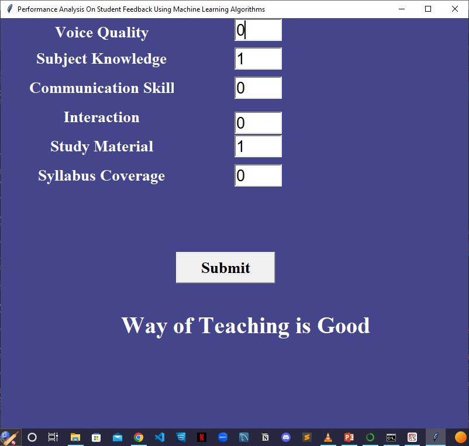
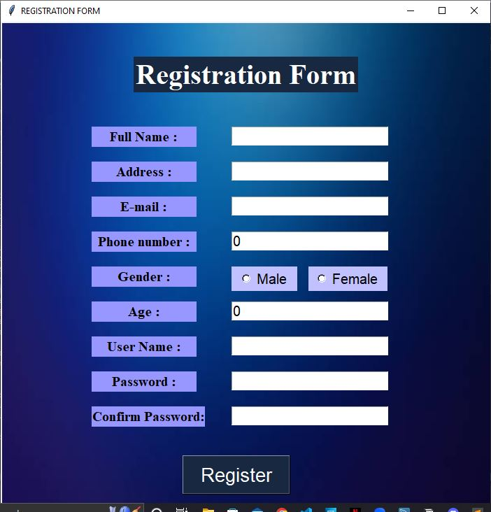
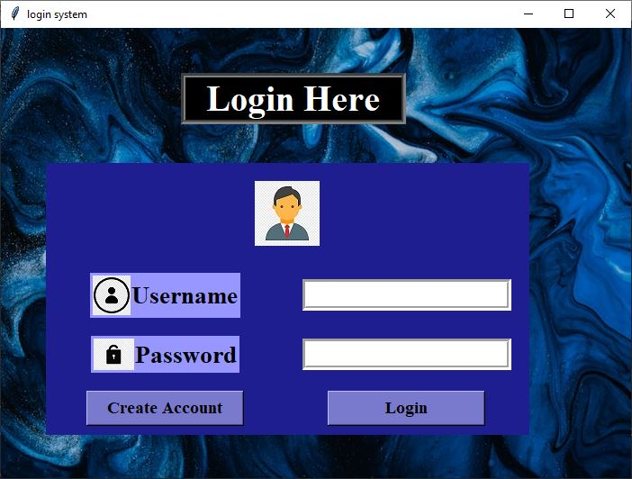
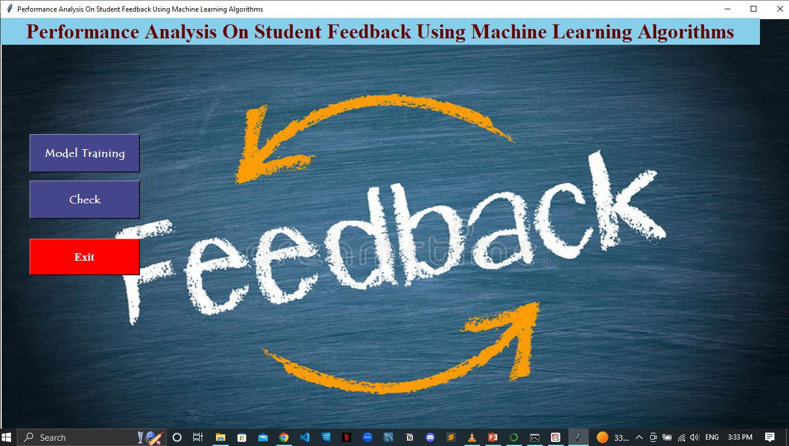

# Student-Feedback

A Student Feedback Mining System is work to inquire about points and their slants as of understudy produced criticism. This strategy will be useful to improve student knowledge and educator's process for conveyance. Automating the student’s feedback may give several advantages together with saving price, time and creating economical report generation, etc. the utilization of opining mining will facilitate in summarizing the feedback report effectively and evaluating school performance in the type of a summarized read might be helpful for the establishments. 

 

## PROJECT WORKFLOW

 
## RESULTS

 

## LAYOUT
### Registration 

### Login

### GUI

